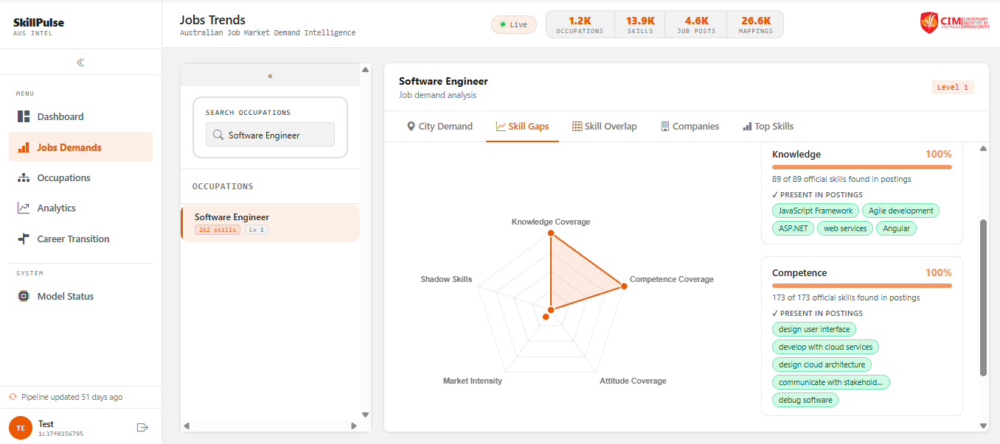
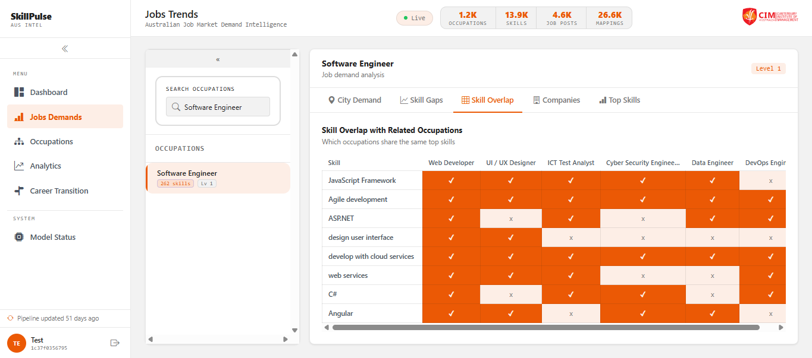
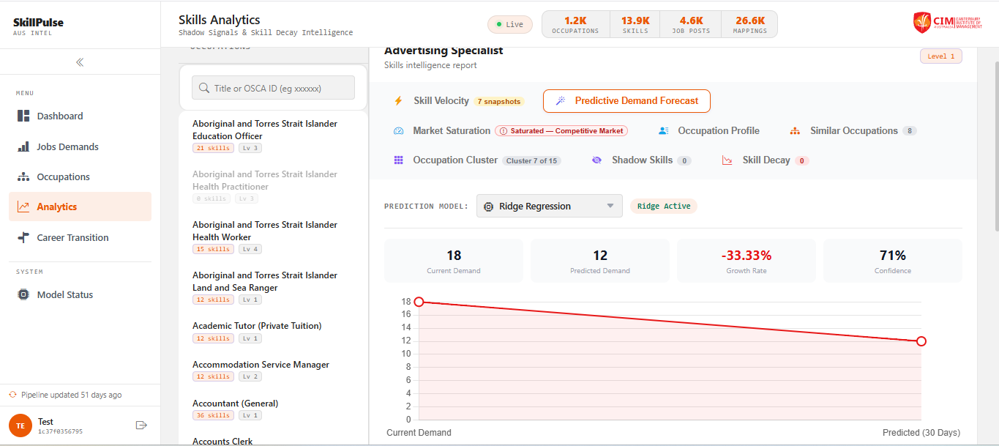
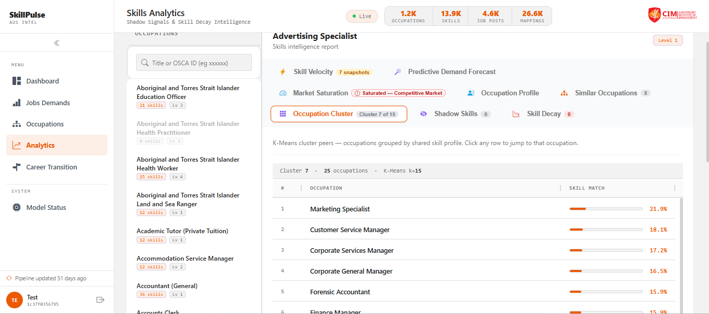
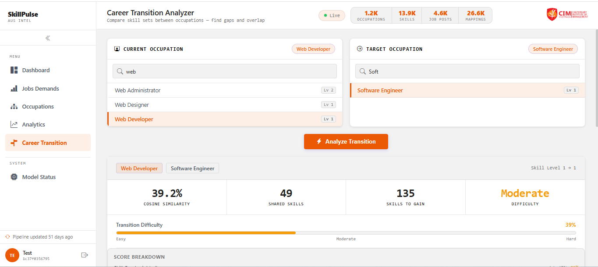
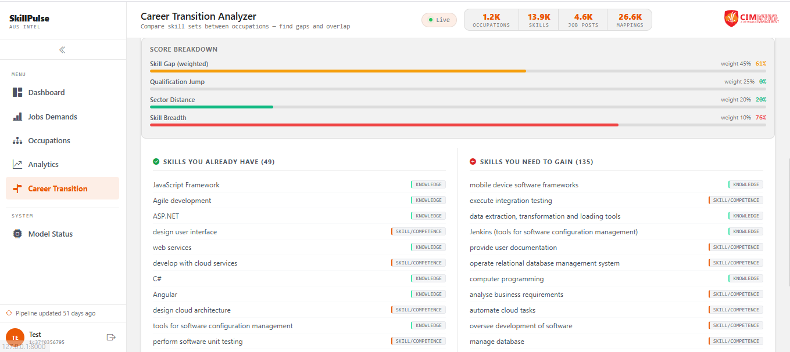

# Territory SkillPulse

**An AI-assisted skills analytical platform for the Northern Territory labour market.**

Built as the capstone project for the Master of Information & Communications Technology at the Canterbury Institute of Management (Darwin Campus), Semester 1, 2026.

---

## The problem

The Northern Territory labour market relies almost entirely on annual government surveys to understand skill demand. By the time the data is published, it's already 6–12 months out of date — leaving job seekers, training institutions, and policy makers without a real-time view of what the market actually wants.

Territory SkillPulse closes that gap by ingesting live job postings, mapping them to standardised occupation and skill taxonomies, and surfacing demand signals through an AI-assisted interface designed for three distinct user groups.

---

## What it does

**For job seekers**
- Upload a CV (PDF or DOCX) and receive a skill-gap analysis mapped to the ESCO taxonomy
- Chat with an AI career advisor grounded in live NT labour market data
- Download a personalised career pathway report as PDF

**For training institutions**
- Track skill velocity (which skills are emerging, stable, or declining)
- Identify "shadow skills" — skills appearing in job posts but not yet in formal qualifications
- Forecast occupation demand 12 months ahead

**For government and policy organisations**
- City-level demand heatmap across the Northern Territory
- Occupation cluster analysis for migration and DAMA planning
- Role-based access control aligned with Australian Privacy Principles

---

## Architecture

A two-service architecture sharing a single PostgreSQL database with the pgvector extension.

```
┌──────────────────────────┐         ┌──────────────────────────┐
│  Territory SkillPulse    │         │   SkillPulse Analytics   │
│  Spring Boot 3.5         │         │   FastAPI 0.135          │
│  Java 21 · Vaadin 24     │         │   Python 3.14            │
│                          │         │                          │
│  • AI career advisor     │         │  • Demand forecasting    │
│  • CV analysis           │         │  • Occupation clustering │
│  • Batch ingestion       │         │  • Skill velocity        │
│  • RAG tool-calling      │         │  • Heatmaps & dashboards │
└──────────┬───────────────┘         └──────────┬───────────────┘
           │                                    │
           └──────────────┬─────────────────────┘
                          │
                ┌─────────▼─────────┐
                │   PostgreSQL      │
                │   + pgvector      │
                │   (HNSW index)    │
                └───────────────────┘
```

**External integrations:** Adzuna Jobs API · OpenAI API (gpt-4o-mini, text-embedding-3-small) · ABS Occupation Coding Service

---

## Tech stack

| Layer | Technologies |
|---|---|
| **Backend (Java)** | Spring Boot 3.5, Spring Batch, Spring AI 1.1.2, Spring Security |
| **Backend (Python)** | FastAPI, SQLAlchemy 2.0, Alembic, Uvicorn |
| **Frontend** | Vaadin 24 (server-side Java), Jinja2 templates, vanilla JS |
| **Database** | PostgreSQL with pgvector extension, HNSW index, cosine similarity |
| **AI / ML** | OpenAI GPT-4o-mini, text-embedding-3-small, scikit-learn (Ridge Regression, K-Means), UMAP |
| **Standards** | OSCA (Australian occupation taxonomy), ESCO (European skills taxonomy) |
| **DevOps** | Docker, docker-compose, Maven, JaCoCo, SonarQube, OWASP Dependency-Check |

---

## My contributions

This was a three-person project. I led the following:

- **UI/UX design** for the Vaadin web platform — login flow, role-based navigation, AI advisor chat view, CV analysis screens, and the downloadable career pathway report layout
- **Frontend development** of those views in Vaadin 24
- **Stakeholder analysis and user stories** — drafted interview questions for job seekers, training institutions, and government policy analysts; translated findings into role-goal user stories using the Lucassen et al. (2016) quality framework
- **Data analysis** for the analytics dashboard views, including the city-level demand heatmap and skill cluster overlap visualisations
- Co-author of the 10,696-word academic project report

Full team contributions are documented in the [Group Charter](docs/group-charter.md) and the project report.

---

## Selected screenshots


login screen

![Dashboard]!(image-8.png)

Dashboard



Job trends



Skill Overlap for the Occupations



AI Model forecast for Occupation



K-means Clustering





Career Transitioning

---

## Repository structure

```
.
├── territory-skillpulse/    # Spring Boot module (Java 21)
├── skillpulse-analytics/    # FastAPI module (Python 3.14)
├── docs/                    # Architecture diagrams, ERDs, project report
└── docker-compose.yml       # One-command local stack
```

---

## Running locally

```bash
# Clone and switch to this branch
git clone https://github.com/AnishBastakoti/Asgn.git
cd Asgn
git checkout Asgnv2

# Configure environment variables
cp .env.example .env
# Edit .env with your OpenAI, Adzuna, and ABS API keys

# Bring up the full stack
docker-compose up -d
```

The Spring Boot UI runs on `http://localhost:8080`, and the FastAPI analytics dashboard on `http://localhost:8000`.

---

## Project status

Submitted April 2026 as a final-year academic prototype. The system demonstrates feasibility of combining LLM tool-calling, vector retrieval, and structured ML pipelines for real-time labour market intelligence at NT scale.

Acknowledged limitations and the path to production are discussed in detail in Chapter 11 of the project report.

---

## Acknowledgements

- **Project supervisor:** Dr Nimish Ukey, Canterbury Institute of Management
- **Team:** Ayesh Jayasekara (Project Lead, AI Architect), Anish Bastakoti (UI/UX, Frontend, Data Analysis), Aba Jobayerazim (QA, Requirements)
- Built on the OSCA occupation taxonomy (Australian Bureau of Statistics) and the ESCO skills taxonomy (European Commission)

---

## Author

**Anish Bastakoti** — Darwin, Northern Territory
[LinkedIn](https://www.linkedin.com/in/anish-bastakoti-a81733181/) · [GitHub](https://github.com/AnishBastakoti)